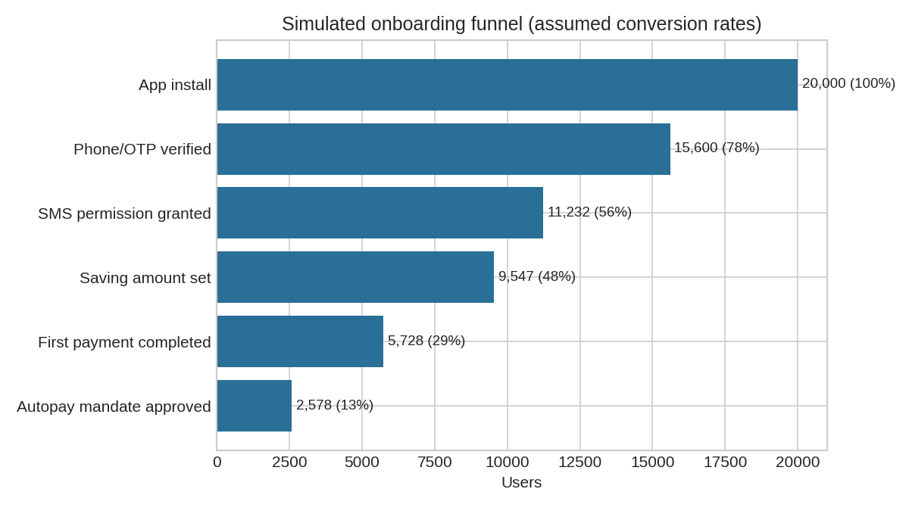
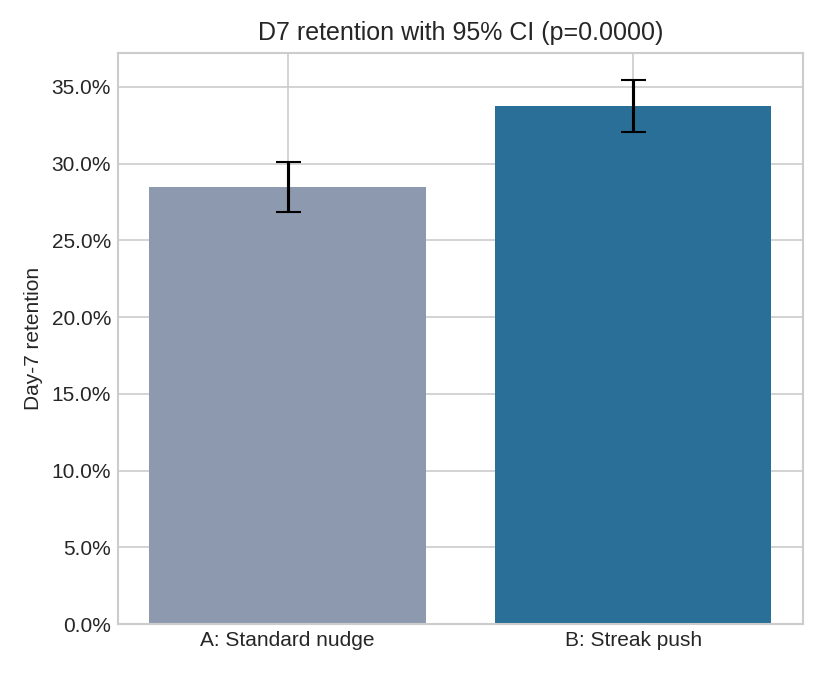

# Jar App: In-App Engagement & A/B Experimentation Teardown

**Author:** _your name_ | **Tools:** Python (Pandas, SciPy, Matplotlib), Excel, Mixpanel/CleverTap (event design)
**Type:** External product-level analysis. All data is simulated from stated assumptions. No Jar data was used.

---

## 1. Business problem
Jar's growth depends on turning a first micro-saving into a habit. Daily push notifications are the main re-engagement lever. This analysis asks whether a gamified streak push ("You're on a 3-day streak, save ₹X to keep it alive") retains more users at Day 7 than the standard daily nudge.

## 2. Funnel audit (product-level)
Sources: hands-on walkthrough of the app and published product teardowns. Each step should be verified against the live app; supporting screenshots belong in `/screenshots`.

```
Splash & value pitch → Phone auth (Truecaller / OTP) → SMS permission priming (round-off engine)
→ Choose saving mode (round-off / daily save) & amount (preset chips) → First payment via UPI intent
→ Optional UPI Autopay mandate → "Spin the wheel" reward → Home (gold balance, streak counter)
```

**Observations that shape the analysis**
- **Two-step permission priming** (in-app explainer, then OS dialog) means that prompt shown and permission granted must be tracked as separate events.
- **KYC is deferred** (per published teardowns), so it is not a signup-funnel drop-off; it becomes a withdrawal-stage event.
- **Payment and mandate are separate:** intent (clicked), completion (approved), and outcome (debit succeeded) must be tracked as separate events, because the UPI handoff is a common point of leakage.
- **The gamified reward screen** immediately after payment is the first retention hook; the streak push extends the same mechanic.

Simulated funnel (assumed rates, see `Funnel` tab): 20,000 installs → 12.9% end with an approved autopay mandate. The largest absolute drop is at phone/OTP verification, and the largest relative drops are at first payment (60% step conversion) and mandate approval (45%).



## 3. Event taxonomy
Naming convention: `object_action`, snake_case, past tense. The full 19-event plan, with trigger, properties and source (client/server/CleverTap), is in `Jar_AB_Experiment_Tracker.xlsx` → `Tracking_Plan`.

Design rules: money events are sent server-side (`mandate_approved`, `first_saving_completed`); `variant` and `campaign_id` are attached to every push event; `push_optout` serves as the guardrail event. The QA checklist (duplicates, null properties, ordering, identity merge, UTC timestamps, sample-ratio mismatch) is in the `QA_Checklist` tab.

## 4. Experiment design
| Item | Choice |
|---|---|
| Hypothesis | Streak push raises D7 retention vs standard nudge |
| Unit / split | Newly activated users (first saving done), randomized 50/50 |
| Primary metric | D7 retention = ≥1 successful saving on day 7 |
| Guardrails | Push opt-out rate, uninstall rate, average saving amount |
| Baseline (assumed) | 30% |
| MDE | 12.8% relative (30% → 33.84%), the smallest lift considered worth the effort |
| α / power | 0.05 two-sided / 80% |
| Sample size | **2,310 per arm** (formula below) |

`n = (Zα/2 + Zβ)² × [p₁(1−p₁) + p₂(1−p₂)] / (p₂−p₁)²` = 7.85 × 0.4339 / 0.001475 ≈ 2,310

The test runs 3,000 users per arm to leave headroom. The metric definition and stopping rule (fixed sample, no interim peeking) should be pre-registered before launch.

## 5. Results (simulated; produced by `ab_analysis.py`, reproduced in Excel)
| Metric | A (Control) | B (Streak) | Difference | p-value |
|---|---|---|---|---|
| **D7 retention** | 28.5% | 33.7% | +5.3 pp (+18.5% relative), 95% CI [+2.9, +7.6] pp | < 0.001 |
| **Push opt-out (guardrail)** | 1.80% | 2.73% | +0.9 pp (+52% relative), 95% CI [+0.2, +1.7] pp | 0.015 |

Cross-checks: the chi-square test agrees with the z-test, the sample-ratio check passed, and the Excel formulas match the Python output.



**Segment analysis (exploratory):** relative lift of +41% in T1, +5% in T2 and +18% in T3. These are small-sample subgroups with high variance and should be treated as hypotheses rather than findings.

**Power check:** at 3,000 per arm, 89% of 2,000 repeated simulated experiments detect the effect. The observed lift (18.5%) is higher than the assumed 12.8% because of sampling noise, which is why the confidence interval is more informative than the point estimate.

## 6. Recommendation memo
**To:** Product & Growth | **Decision:** Roll out the streak push in stages rather than to 100% of users immediately.

1. **The retention gain is statistically clear** (+5.3 pp, confidence interval excludes zero).
2. **Opt-outs rose by about 0.9 pp.** Each opt-out permanently removes a re-engagement channel, so the retention gain must be weighed against that loss.
3. **Action:** ship to 20% of new users and monitor opt-out and uninstall rates for two weeks. If the opt-out increase stays below an agreed ceiling (e.g. +0.5 pp), scale up.
4. **Follow-up tests:** (a) cap streak pushes at one per day and test softer copy to reduce opt-outs; (b) test push timing; (c) validate the T1 vs T2 difference with a dedicated test.
5. **Instrumentation prerequisite:** confirm `variant` and `campaign_id` are populated on 100% of push events before launch.

## 7. Limitations
- The data is simulated and the effect was built in, so this validates the method and pipeline, not the real-world impact of streak pushes.
- Baselines, funnel rates and opt-out rates are assumptions, not Jar figures.
- A real test requires novelty-effect checks (run for at least two weeks) and multiple-comparison correction when cutting segments.

## 8. Repo structure
```
ab_analysis.py                  # simulation + analysis (run: python ab_analysis.py)
Jar_AB_Experiment_Tracker.xlsx  # funnel, tracking plan, QA, raw data, live-formula analysis
data/                           # funnel.csv, experiment_users.csv
charts/                         # funnel.png, retention_ab.png
```
Requirements: `pip install numpy pandas scipy matplotlib openpyxl`
